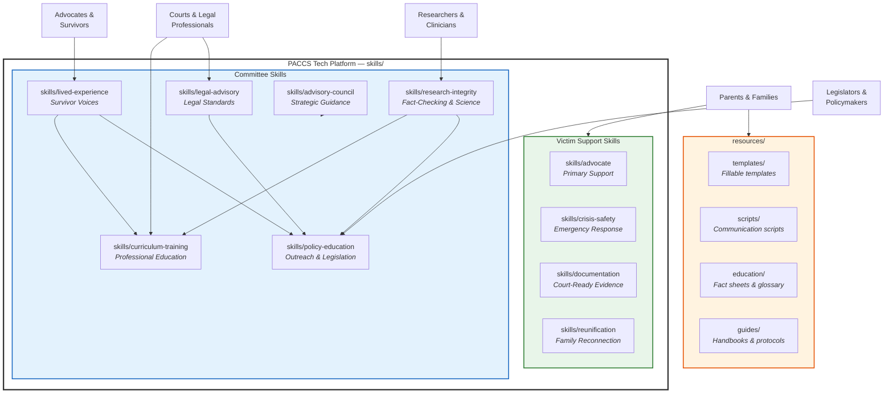
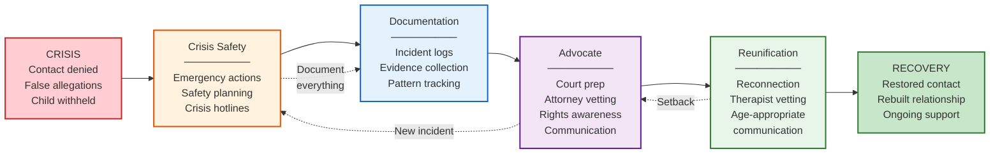
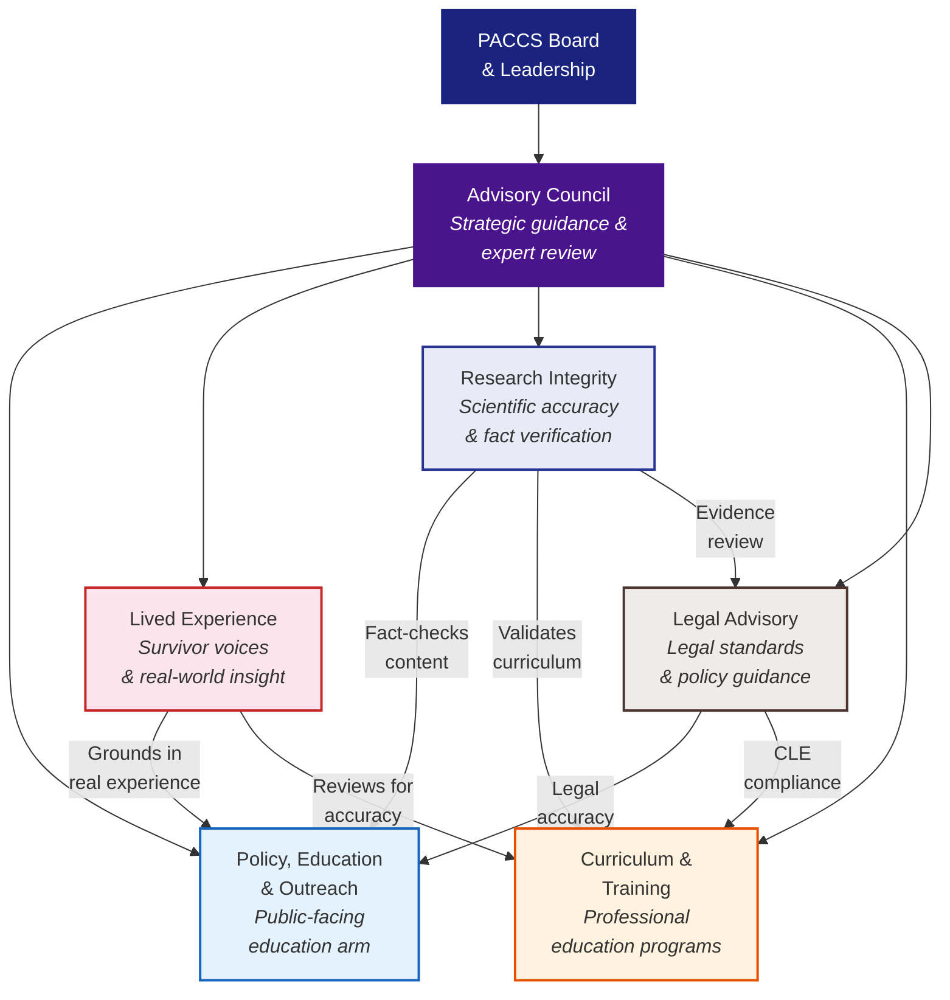
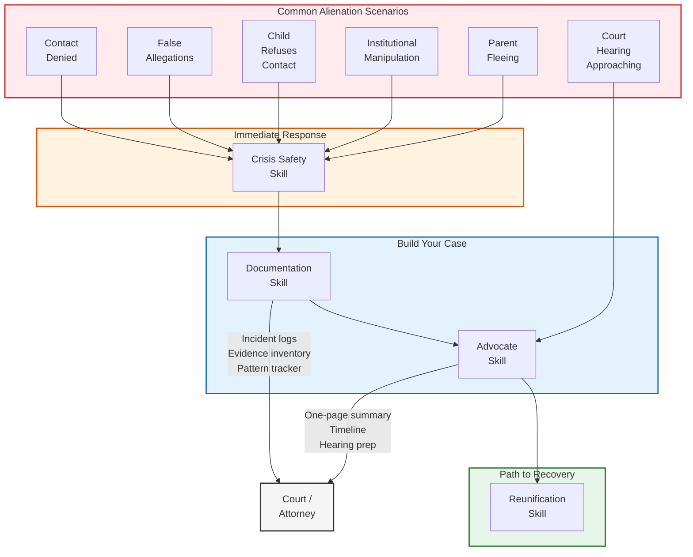
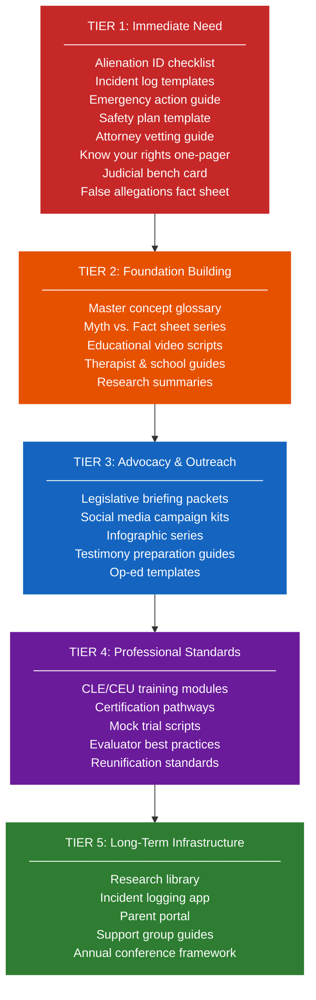
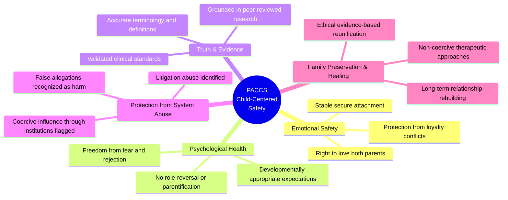
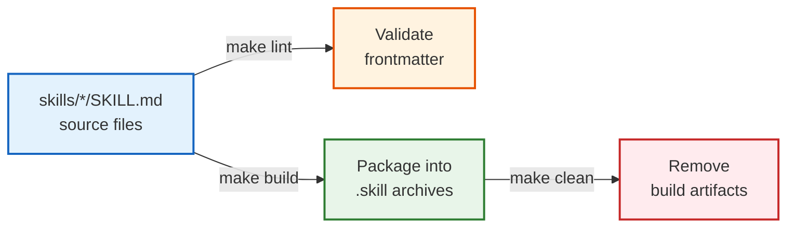

# PACCS — Professional Alliance for Child Centered Safety

AI-powered skill packages and resources supporting victims of parental alienation through advocacy, documentation, crisis response, reunification support, research integrity, and professional training.

---

## What Is PACCS?

PACCS is a multidisciplinary organization focused on protecting children's emotional and psychological safety. We provide evidence-based tools and resources for:

- **Targeted parents** experiencing parental alienation, false allegations, and contact denial
- **Children and families** going through reunification after alienation
- **Legal professionals** (judges, attorneys, GALs, evaluators) handling alienation cases
- **Mental health professionals** working with alienated families
- **Legislators and policymakers** shaping child-centered custody reform
- **Educators and schools** recognizing and responding to alienation dynamics

---

## System Architecture



---

## Victim Support Journey

How a targeted parent moves through PACCS resources from crisis to recovery:



---

## Committee Structure & Collaboration



---

## Skill Capabilities Map

### Skills for Victim Support

| Skill | Path | Purpose | Key Deliverables |
|-------|------|---------|-----------------|
| Advocate | `skills/advocate/` | Primary support for targeted parents | Incident logs, court prep checklists, communication scripts, evidence organization, safety plans, resource navigation |
| Crisis Safety | `skills/crisis-safety/` | Emergency response guidance | Emergency action checklists for 6 crisis scenarios, safety plan templates, crisis hotline resources |
| Documentation | `skills/documentation/` | Court-ready evidence building | Incident log templates, master timelines, behavior pattern trackers, evidence inventories, court-ready language guide |
| Reunification | `skills/reunification/` | Family reconnection support | Age-appropriate letters, therapist vetting, reunification milestone tracking, red flag identification |

### Skills for Committees

| Skill | Path | Purpose | Key Deliverables |
|-------|------|---------|-----------------|
| Policy Education | `skills/policy-education/` | Public education & legislative outreach | Legislative one-pagers, myth vs. fact sheets, video scripts, audience-specific advocacy asks |
| Lived Experience | `skills/lived-experience/` | Survivor-informed review & testimony | Anonymized case summaries, testimony preparation, material review, system gap reports |
| Research Integrity | `skills/research-integrity/` | Scientific accuracy & fact-checking | Fact-check reports, research summaries, legislation tracking, misinformation alerts |
| Curriculum Training | `skills/curriculum-training/` | Professional education programs | CEU/CLE modules, training outlines, assessments, facilitator guides, role-play scenarios |
| Legal Advisory | `skills/legal-advisory/` | Legal standards & court resources | Legislation summaries, motion templates, courtroom scripts, CLE content, legal trend reports |
| Advisory Council | `skills/advisory-council/` | Strategic organizational guidance | Strategic reviews, risk assessments, cross-committee coordination, partnership recommendations |

---

## Alienation Response Framework

How PACCS skills map to common alienation scenarios:



---

## Documentation Workflow

How to build court-ready evidence using PACCS tools:

```mermaid
flowchart LR
    subgraph collect["1. COLLECT"]
        E1["Texts &<br/>Emails"]
        E2["Call Logs &<br/>Recordings"]
        E3["Witness<br/>Statements"]
        E4["School &<br/>Medical Records"]
        E5["Social Media<br/>Posts"]
        E6["Child's<br/>Statements"]
    end

    subgraph document["2. DOCUMENT"]
        D1["Incident Log<br/><i>Date, time, facts,<br/>evidence, witnesses</i>"]
        D2["Communication Log<br/><i>Co-parent<br/>interactions</i>"]
        D3["Child Observation<br/>Journal<br/><i>Verbatim quotes,<br/>behaviors</i>"]
    end

    subgraph organize["3. ORGANIZE"]
        O1["Master Timeline<br/><i>Chronological<br/>event history</i>"]
        O2["Behavior Pattern<br/>Tracker<br/><i>Alienating behaviors<br/>mapped over time</i>"]
        O3["Evidence<br/>Inventory<br/><i>Cataloged with<br/>storage locations</i>"]
    end

    subgraph present["4. PRESENT"]
        P1["One-Page<br/>Summary"]
        P2["Court Hearing<br/>Prep Packet"]
        P3["Attorney<br/>Briefing"]
    end

    collect --> document
    document --> organize
    organize --> present

    style collect fill:#e3f2fd,stroke:#1565c0,stroke-width:2px
    style document fill:#fff3e0,stroke:#e65100,stroke-width:2px
    style organize fill:#f3e5f5,stroke:#6a1b9a,stroke-width:2px
    style present fill:#e8f5e9,stroke:#2e7d32,stroke-width:2px
```



---

## Artifact Roadmap Tiers

Prioritized build plan for PACCS advocacy resources. See [full roadmap](resources/guides/ARTIFACTS-ROADMAP.md) for 100+ items.



---

## PACCS Five Pillars of Child-Centered Safety



---

## Recognizing Parental Alienation

The 10 categories of alienating behavior that PACCS skills help document:

```mermaid
flowchart TB
    PA["PARENTAL<br/>ALIENATION<br/>BEHAVIORS"]
    
    B1["1. Access Denial<br/><i>Blocking visitation,<br/>scheduling conflicts</i>"]
    B2["2. Denigration<br/><i>Badmouthing the<br/>targeted parent</i>"]
    B3["3. Limiting Contact<br/><i>Restricting calls,<br/>blocking messages</i>"]
    B4["4. Emotional<br/>Manipulation<br/><i>Guilt for loving<br/>the other parent</i>"]
    B5["5. False Allegations<br/><i>Fabricating abuse<br/>or safety concerns</i>"]
    B6["6. Role Reversal<br/><i>Child as messenger,<br/>spy, or confidant</i>"]
    B7["7. Erasing the<br/>Other Parent<br/><i>Removing photos,<br/>changing names</i>"]
    B8["8. Institutional<br/>Manipulation<br/><i>Using schools, doctors<br/>to exclude parent</i>"]
    B9["9. Legal Abuse<br/><i>Weaponizing courts<br/>through endless motions</i>"]
    B10["10. Enmeshment<br/><i>Child mirrors<br/>alienating parent's views</i>"]

    PA --> B1
    PA --> B2
    PA --> B3
    PA --> B4
    PA --> B5
    PA --> B6
    PA --> B7
    PA --> B8
    PA --> B9
    PA --> B10

    style PA fill:#c62828,stroke:#c62828,color:#fff,stroke-width:3px
    style B1 fill:#ffebee,stroke:#c62828
    style B2 fill:#ffebee,stroke:#c62828
    style B3 fill:#ffebee,stroke:#c62828
    style B4 fill:#ffebee,stroke:#c62828
    style B5 fill:#ffebee,stroke:#c62828
    style B6 fill:#ffebee,stroke:#c62828
    style B7 fill:#ffebee,stroke:#c62828
    style B8 fill:#ffebee,stroke:#c62828
    style B9 fill:#ffebee,stroke:#c62828
    style B10 fill:#ffebee,stroke:#c62828
```



---

## Build System



### Commands

```bash
make build                        # Package all 10 skills into .skill files
make lint                         # Validate all SKILL.md frontmatter
make clean                        # Remove build artifacts
make help                         # Show all available commands
```

---

## Project Structure

```
paccs/
├── skills/                                # AI skill definitions (10 roles)
│   ├── advocate/SKILL.md                  #   Primary victim support
│   ├── crisis-safety/SKILL.md             #   Crisis & safety planning
│   ├── documentation/SKILL.md             #   Documentation & evidence
│   ├── reunification/SKILL.md             #   Reunification support
│   ├── policy-education/SKILL.md          #   Policy & outreach
│   ├── lived-experience/SKILL.md          #   Lived experience
│   ├── research-integrity/SKILL.md        #   Research integrity
│   ├── curriculum-training/SKILL.md       #   Training & curriculum
│   ├── legal-advisory/SKILL.md            #   Legal advisory
│   └── advisory-council/SKILL.md          #   Advisory council
├── resources/                             # Human-facing materials
│   ├── guides/                            #   Handbooks & protocols
│   │   ├── ADVOCATE-HANDBOOK.md
│   │   ├── ARTIFACTS-ROADMAP.md
│   │   ├── REUNIFICATION-PROTOCOL.md
│   │   ├── VICTIMS-GUIDE.md
│   │   └── PACCS Committee Handbook.pdf
│   ├── templates/                         #   Fillable templates
│   │   ├── communication/
│   │   ├── court-prep/
│   │   ├── documentation/
│   │   ├── reunification/
│   │   ├── safety/
│   │   └── vetting/
│   ├── scripts/                           #   Communication scripts
│   │   ├── attorney/
│   │   ├── co-parent/
│   │   ├── court-testimony/
│   │   ├── media-interview/
│   │   └── school/
│   └── education/                         #   Glossary, fact sheets, briefs
├── outreach/                              # Public-facing materials
│   ├── campaigns/                         #   8 advocate-type campaigns
│   ├── legislative/
│   ├── media/
│   ├── myth-vs-fact/
│   ├── social-media/
│   └── video-scripts/
├── processes/                             # Operational workflows
├── index.html                             # Public-facing landing page
├── paccs-tech.skill                       # Unified skill (all 10 roles)
├── Makefile                               # Build automation
├── CHANGELOG.md
├── LICENSE
└── README.md
```

---

## Key Resources

- **[VICTIMS-GUIDE.md](resources/guides/VICTIMS-GUIDE.md)** — Step-by-step guide for parents experiencing alienation — what to do right now, how to build your case, find the right help, protect your mental health, and never give up.
- **[ADVOCATE-HANDBOOK.md](resources/guides/ADVOCATE-HANDBOOK.md)** — Comprehensive handbook for PACCS advocates — how to support victims, navigate systems, help build cases, work with schools and medical providers, and avoid burnout.
- **[REUNIFICATION-PROTOCOL.md](resources/guides/REUNIFICATION-PROTOCOL.md)** — 5-phase reunification protocol with criminal custodial interference guidance, diagnosis & assessment frameworks (DSM-5, ICD-11), treatment interventions, evaluator standards, and adult children of alienation support.
- **[ARTIFACTS-ROADMAP.md](resources/guides/ARTIFACTS-ROADMAP.md)** — Prioritized list of 100+ artifacts to build, organized into 5 tiers from immediate crisis resources to long-term organizational infrastructure.
- **[PACCS Committee Handbook](resources/guides/PACCS%20Committee%20Handbook.pdf)** — Complete handbook covering all 7 PACCS committees with definitions, structure, goals, and deliverables.

---

## Crisis Resources

If you or someone you know is in immediate danger:

| Resource | Contact |
|----------|---------|
| **Emergency** | **911** |
| Childhelp National Child Abuse Hotline | 1-800-422-4453 (24/7) |
| National Domestic Violence Hotline | 1-800-799-7233 (24/7) |
| National Suicide Prevention Lifeline | **988** (24/7) |
| Crisis Text Line | Text **HOME** to **741741** |
| National Center for Missing & Exploited Children | 1-800-843-5678 |
| Legal Aid | [lawhelp.org](https://lawhelp.org) |

---

## Guiding Principles

All PACCS skills enforce these non-negotiable guardrails:

- **No professional advice** — general information and process support only; always recommend qualified professionals
- **Safety first** — directs users to emergency services and crisis hotlines
- **Privacy** — never requests identifying details; encourages redaction of sensitive data
- **Evidence integrity** — neutral language, no fabricated facts, no coaching false statements
- **Child-centered** — every recommendation prioritizes the child's emotional and psychological wellbeing
- **Both parents matter** — supports the child's right to a safe relationship with both parents

---

## Author

Doug Devitre (dougdevitre@gmail.com)

---

*PACCS — Because every child deserves emotional and psychological safety.*
