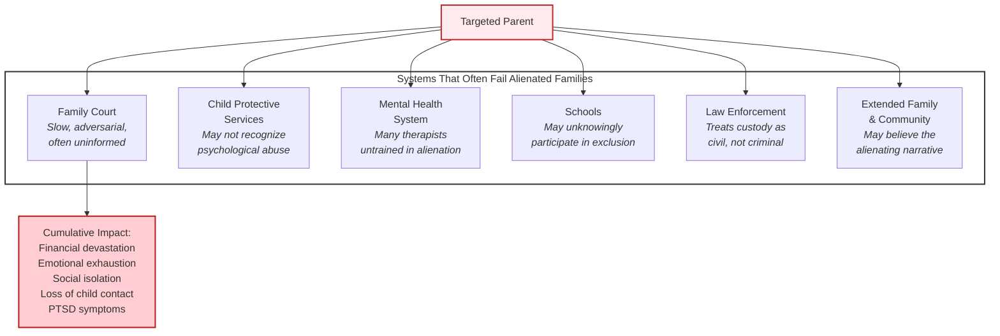
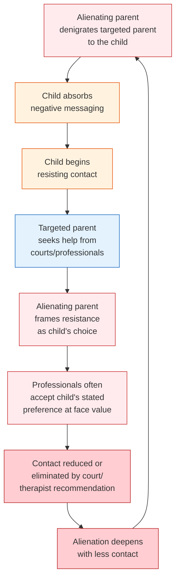
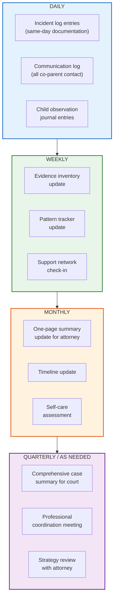
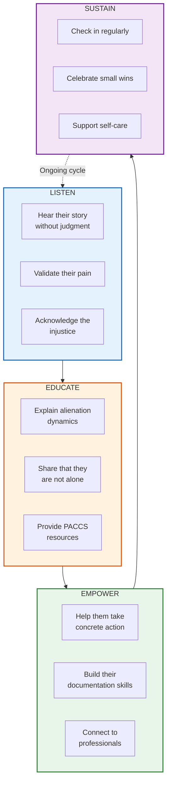
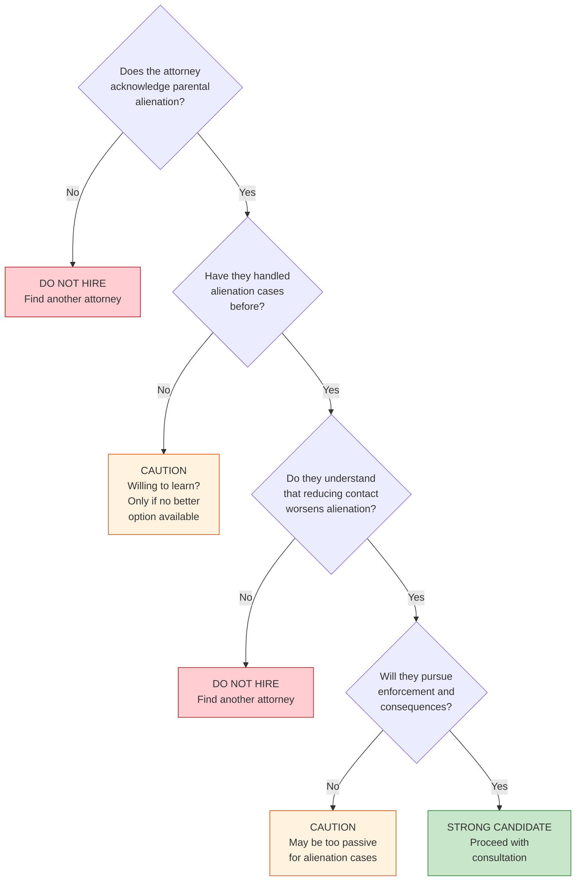
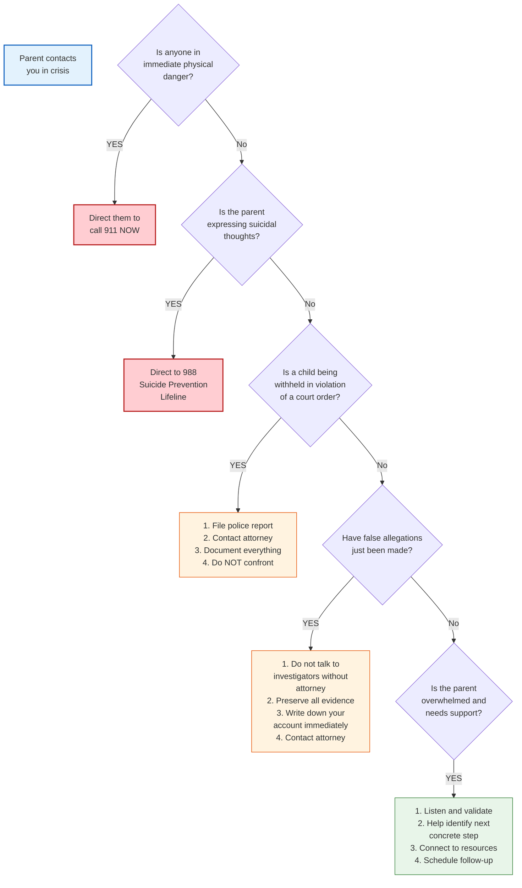

# PACCS Advocate Handbook

A comprehensive guide for parental alienation advocates — how to support victims, navigate systems, build cases, and create change.

---

## Who Is This For?

This handbook is for anyone supporting a parent or family experiencing parental alienation:

- **Parents** advocating for themselves and their children
- **Family members** (grandparents, siblings, extended family) affected by alienation
- **Professional advocates** working with alienated families
- **Support group leaders** facilitating peer support
- **PACCS committee members and volunteers**

---

## Understanding the Landscape

### What Victims Face



### The Cycle of Alienation



**The critical insight:** Reducing contact is almost always the wrong remedy when alienation is present. It rewards the alienating behavior and deepens the child's psychological harm.

---

## The Advocate's Toolkit

### Core Competencies

Every PACCS advocate should be able to:

1. **Recognize alienation** — distinguish it from estrangement and other causes of contact problems
2. **Document effectively** — help parents create court-ready, factual records
3. **Navigate the system** — understand family court procedures, CPS processes, and professional roles
4. **Communicate strategically** — frame alienation in language courts and professionals understand
5. **Support emotionally** — provide trauma-informed peer support without crossing into therapy
6. **Connect to resources** — link families with qualified attorneys, therapists, and evaluators
7. **Advocate systemically** — push for policy reform, professional training, and public awareness
8. **Maintain boundaries** — know what advocates can and cannot do

### What Advocates CAN Do

- Listen actively and validate the parent's experience
- Help organize documentation and evidence
- Accompany parents to court hearings (as support, not counsel)
- Share educational materials about alienation
- Connect parents with qualified professionals
- Facilitate support group meetings
- Share their own story (if they choose) to reduce isolation
- Write letters of support (factual observations, not opinions)
- Help navigate school, medical, and agency communications
- Provide emotional support and encouragement

### What Advocates CANNOT Do

- Provide legal advice (even if they have legal knowledge)
- Provide therapeutic counsel (even if they have clinical training)
- Diagnose alienation or any mental health condition
- Speak on behalf of the parent in court without authorization
- Contact the alienating parent directly
- Contact the child directly without the parent's guidance
- Promise specific outcomes
- Replace professional services (attorney, therapist, evaluator)

---

## Helping Parents Build Their Case

### The Documentation Framework



### What Courts Want to See

Courts are most persuaded by evidence that is:

| Quality | Description | Example |
|---------|-------------|---------|
| **Factual** | Observable events, not interpretations | "Co-parent did not bring child to exchange at 5pm as ordered" not "Co-parent is deliberately sabotaging my relationship" |
| **Contemporaneous** | Documented at or near the time it happened | Incident log entry dated the same day |
| **Specific** | Dates, times, locations, exact words | "On 3/15/2026 at 4:47pm, co-parent texted: '[exact quote]'" |
| **Patterned** | Shows recurring behavior over time | "Exchange denied on: 1/5, 1/19, 2/2, 2/16, 3/1..." |
| **Corroborated** | Supported by independent evidence | Text messages, emails, witness statements, school records |
| **Balanced** | Includes positive events too | Shows credibility and objectivity |
| **Organized** | Easy to review quickly | Timeline format, table format, executive summary |

### Common Mistakes Parents Make (Help Them Avoid These)

| Mistake | Why It Hurts | What to Do Instead |
|---------|-------------|-------------------|
| Venting on social media | Alienating parent screenshots it; judge sees it as unstable | Document privately, vent to therapist or support group |
| Badmouthing alienating parent to the child | Judge sees both parents as problematic; child is further harmed | Never. Ever. Period. |
| Sending long emotional texts to co-parent | Makes parent look unhinged; provides ammunition | Keep all communication brief, factual, child-focused (BIFF method) |
| Not following court orders (even unfair ones) | Gives alienating parent grounds for contempt; undermines credibility | Follow every order to the letter, even when it hurts |
| Representing themselves in court | Alienation cases are complex; self-representation rarely succeeds | Get an attorney, even if it means legal aid |
| Choosing a therapist who doesn't understand alienation | Therapist may reinforce the alienation or recommend less contact | Vet every professional using PACCS criteria |
| Waiting too long to act | Time benefits the alienator; the longer the separation, the harder reunification | Act quickly and decisively through proper legal channels |
| Giving up | Some parents surrender out of exhaustion or hopelessness | Stay in the fight — children need you, even when they can't say it |

---

## Supporting Parents Emotionally

### Understanding the Trauma

Targeted parents often experience:
- **Ambiguous grief** — the child is alive but absent
- **Complex PTSD** — from sustained abuse through the legal system
- **Financial devastation** — legal fees, lost income, poverty
- **Social isolation** — friends and family may believe the alienating narrative
- **Identity crisis** — "Am I a bad parent? Is this my fault?"
- **Suicidal ideation** — the pain of losing a child is immense

### The PACCS Support Model



### What to Say (and Not Say)

| Say This | Not This |
|----------|----------|
| "I believe you. This is real." | "Are you sure it's really alienation?" |
| "This is not your fault." | "What did you do to cause this?" |
| "Your child needs you to keep fighting." | "Maybe it's time to move on." |
| "Let's figure out your next step." | "You should just..." (unsolicited advice) |
| "How are YOU doing through this?" | (Only asking about the case, never about them) |
| "Would you like to hear about a resource?" | "You need to do X right now." |
| "I'm here. You're not alone." | "I know exactly how you feel." (unless you truly do) |

### When to Escalate

Refer to professional help immediately if the parent:
- Expresses suicidal thoughts or hopelessness about living
- Shows signs of substance abuse as a coping mechanism
- Is unable to function (work, eat, sleep, care for themselves)
- Is making threats against the alienating parent
- Is planning to take matters into their own hands (violating orders, confrontations)
- Is experiencing a mental health crisis

**National Suicide Prevention Lifeline: 988**
**Crisis Text Line: Text HOME to 741741**

---

## Navigating the Professional Landscape

### Finding the Right Attorney



### Attorney Vetting Questions

1. How many parental alienation cases have you handled?
2. What is your understanding of parental alienation?
3. How do you approach a case where a child is refusing contact?
4. What strategies do you use to enforce custody orders?
5. How do you respond when the other side alleges abuse as a tactic?
6. Are you willing to pursue contempt, sanctions, and custody modification if needed?
7. How do you work with custody evaluators and reunification therapists?
8. What is your experience with emergency motions?
9. How do you communicate with clients? How quickly do you respond?
10. What are your fees and how do you structure billing?

### Finding the Right Therapist

**For the Parent:**
- Must understand alienation (not just "high-conflict divorce")
- Experience with trauma, grief, and ambiguous loss
- Supportive of the parent maintaining their fight for the child
- Will NOT suggest "letting go" or "accepting" the loss

**For the Child (if you can influence the choice):**
- Must have specific alienation training
- Will NOT treat the child's rejection as a boundary to be respected
- Understands that the child's stated preference may be a product of manipulation
- Will report honestly to the court, even when the child resists

**For Reunification:**
- See [Reunification Protocol](REUNIFICATION-PROTOCOL.md) for detailed vetting criteria

### Finding the Right Evaluator

- Must have forensic evaluation training AND alienation-specific training
- Will evaluate BOTH parents with equal depth
- Will interview collateral contacts
- Will review documentation and evidence
- Will assess alienating behaviors, not just parenting capacity
- Will make recommendations the court needs to hear, even if unpopular

---

## Working with Schools

Schools are often unknowing participants in alienation. Common issues:

| Issue | Advocacy Response |
|-------|-------------------|
| Only one parent listed on records | Send written notice with custody order asserting both parents' rights |
| Only alienating parent receives communications | Request in writing that all communications go to both parents |
| Parent excluded from school events | Provide custody order to school; request inclusion in all events |
| Child enrolled in new school without knowledge | Contact school district; provide custody order; request immediate notification |
| Teacher making custody-related decisions | Remind school that custody is a court matter; teachers should not take sides |
| School counselor reinforcing alienation | Provide alienation education materials; request that counselor consult with a specialist |

### Template: Letter to School Asserting Parental Rights

```
[Date]

[School Name]
[Address]

Re: [Child's Name], [Grade/Class]

Dear [Principal/Registrar],

I am writing to confirm that I am [Child's Name]'s [mother/father/legal guardian]
and to assert my parental rights under [state statute] and the attached custody order.

I am requesting:
1. That I be listed as a parent/guardian in all school records
2. That I receive all communications, report cards, and notices
3. That I have access to all school records for my child
4. That I be permitted to attend all school events and conferences
5. That no changes to enrollment be made without my consent or court order

Enclosed please find a copy of the current custody order for your records.

Please confirm receipt of this letter and compliance with these requests
in writing within [X] business days.

Sincerely,
[Name]
[Contact Information]

Enclosures: Custody Order (certified copy)
```

---

## Working with Medical Providers

Similar issues arise with medical providers:

- [ ] Send written notice to all providers asserting parental rights
- [ ] Provide copy of custody order
- [ ] Request that both parents be notified of all appointments
- [ ] Request copies of all medical records
- [ ] Document any instances of exclusion
- [ ] If a provider refuses to recognize your rights, file a complaint with their licensing board

---

## Self-Care for Advocates

Advocacy work is emotionally demanding. Protect yourself:

### Recognizing Compassion Fatigue

| Warning Sign | Response |
|-------------|----------|
| Feeling emotionally numb after hearing parents' stories | Take a break; process with your own support person |
| Difficulty sleeping or intrusive thoughts about cases | Establish boundaries between advocacy and personal time |
| Feeling helpless or hopeless about making change | Reconnect with wins; celebrate progress |
| Overidentifying with cases (especially if you have lived experience) | Maintain healthy boundaries; you are a guide, not a savior |
| Neglecting your own relationships and needs | Schedule non-negotiable personal time |

### Advocate Self-Care Checklist

- [ ] I have my own therapist or support person (not the families I help)
- [ ] I set clear boundaries on availability (I am not on-call 24/7)
- [ ] I take regular breaks from advocacy work
- [ ] I celebrate small victories
- [ ] I have interests and relationships outside of advocacy
- [ ] I recognize when I'm triggered and step back
- [ ] I don't carry cases alone — I have a team or co-advocate
- [ ] I know my limits and refer to professionals when needed

---

## Measuring Impact

### For Individual Cases

Track outcomes for families you support:

| Metric | Measurement |
|--------|-------------|
| Contact restored? | Yes / No / Partial / In progress |
| Time from crisis to first professional contact | Days/weeks |
| Documentation system in place? | Yes / No |
| Connected to qualified attorney? | Yes / No |
| Connected to qualified therapist? | Yes / No |
| Court outcomes (favorable / unfavorable / mixed) | Track per hearing |
| Parent's self-reported wellbeing (1-10) | Monthly check-in |

### For Systemic Advocacy

| Metric | Measurement |
|--------|-------------|
| Professionals educated about alienation | Number per quarter |
| Legislative briefings delivered | Number per year |
| Media mentions of PACCS / alienation education | Count and reach |
| Support group meetings held | Number and attendance |
| Materials distributed | Count by type |
| Policy changes influenced | Track by jurisdiction |

---

## Quick Reference: Crisis Response Flowchart



---

## Disclaimer

This handbook is for **educational and informational purposes only**. It does not constitute legal, medical, or mental health advice. Every family's situation is unique. Always recommend that families work with qualified professionals.

---

*PACCS — Professional Alliance for Child Centered Safety*
*Advocate Handbook v1.0*
