# PACCS Reunification Protocol

A comprehensive, evidence-based framework for ethical parent-child reunification after parental alienation. This protocol guides families, professionals, and courts through every phase of restoring a child's relationship with a targeted parent.

---

## Protocol Overview

```mermaid
flowchart TB
    subgraph phase1["PHASE 1: Assessment & Readiness"]
        A1["Identify alienation<br/>dynamics"]
        A2["Evaluate safety<br/>for all parties"]
        A3["Assess child's<br/>developmental needs"]
        A4["Select qualified<br/>reunification team"]
        A5["Establish court<br/>orders & structure"]
    end

    subgraph phase2["PHASE 2: Preparation"]
        B1["Prepare targeted<br/>parent"]
        B2["Prepare<br/>child"]
        B3["Address alienating<br/>parent's role"]
        B4["Coordinate<br/>professionals"]
        B5["Set environment<br/>& logistics"]
    end

    subgraph phase3["PHASE 3: Reintroduction"]
        C1["Therapeutic<br/>bridge sessions"]
        C2["Graduated<br/>contact plan"]
        C3["Monitor child's<br/>response"]
        C4["Address<br/>resistance"]
        C5["Adjust pace<br/>as needed"]
    end

    subgraph phase4["PHASE 4: Stabilization"]
        D1["Expand contact<br/>duration & types"]
        D2["Build routines<br/>& normalcy"]
        D3["Reduce<br/>supervision"]
        D4["Strengthen<br/>parent-child bond"]
        D5["Address ongoing<br/>alienating behaviors"]
    end

    subgraph phase5["PHASE 5: Long-Term Integration"]
        E1["Normalized<br/>parenting time"]
        E2["Ongoing<br/>monitoring"]
        E3["Relapse<br/>prevention"]
        E4["Family therapy<br/>as needed"]
        E5["Court review<br/>& modification"]
    end

    phase1 --> phase2 --> phase3 --> phase4 --> phase5

    style phase1 fill:#e3f2fd,stroke:#1565c0,stroke-width:2px
    style phase2 fill:#fff3e0,stroke:#e65100,stroke-width:2px
    style phase3 fill:#f3e5f5,stroke:#6a1b9a,stroke-width:2px
    style phase4 fill:#e8f5e9,stroke:#2e7d32,stroke-width:2px
    style phase5 fill:#e0f7fa,stroke:#00695c,stroke-width:2px
```

---

## Guiding Principles

Before any reunification begins, all parties and professionals must understand:

1. **Parental alienation is child abuse.** The child's rejection of a parent is a symptom of the alienation, not evidence that the relationship should end.
2. **Children do not have the right to sever a relationship with a safe parent.** A child's expressed preference, when influenced by alienation, does not override their need for both parents.
3. **Reunification is the child's right.** The goal is restoring the child's relationship with a safe parent — not punishing either parent.
4. **The alienating dynamic must stop.** Reunification cannot succeed while active alienation continues.
5. **Time is the enemy.** The longer the separation, the harder the reunification. Delays benefit the alienating parent.
6. **Professional competence matters.** Not every therapist is qualified. Reunification requires specific training and experience.
7. **Court authority is essential.** Voluntary cooperation from an alienating parent is rare. Court orders with enforcement mechanisms are usually necessary.
8. **The child's distress during reunification is expected and manageable.** Initial resistance does not mean reunification is harmful — it means the alienation was effective.

---

## Phase 1: Assessment & Readiness

### 1.1 Alienation Assessment

Before reunification begins, a qualified professional must assess:

**For the Child:**
- [ ] Child's expressed rejection of the targeted parent (severity, duration, consistency)
- [ ] Presence of the "independent thinker" phenomenon (child claims decision is their own)
- [ ] Absence of ambivalence (targeted parent is all bad, alienating parent is all good)
- [ ] Extension of rejection to targeted parent's extended family
- [ ] Use of adult language, legal concepts, or borrowed scenarios
- [ ] Child's knowledge of events they could not have witnessed
- [ ] Disproportionate reaction relative to any actual negative experiences
- [ ] Reflexive, rehearsed-sounding rejection vs. genuine emotional response

**For the Alienating Parent:**
- [ ] Pattern of access denial or interference
- [ ] History of denigration (documented statements to or in front of the child)
- [ ] False allegations (prior allegations, investigations, outcomes)
- [ ] Institutional manipulation (schools, doctors, therapists used to exclude)
- [ ] Litigation abuse (pattern of motions, delays, frivolous claims)
- [ ] Enmeshment dynamics (role reversal, parentification, child as confidant)
- [ ] Resistance to professional recommendations or court orders
- [ ] Undermining of prior reunification attempts

**For the Targeted Parent:**
- [ ] History of safe, loving parenting prior to alienation
- [ ] Absence of substantiated abuse, neglect, or safety concerns
- [ ] Willingness to participate in reunification process
- [ ] Emotional readiness (realistic expectations, patience, resilience)
- [ ] Support system in place

### 1.2 Safety Screening

Reunification must NOT proceed if there is substantiated evidence of:
- Physical abuse by the targeted parent
- Sexual abuse by the targeted parent
- Severe neglect by the targeted parent
- Active substance abuse rendering the targeted parent unsafe
- Untreated severe mental illness rendering the targeted parent unsafe

**Important:** False allegations must be distinguished from substantiated findings. A false allegation does not disqualify reunification — it is evidence of alienation.

### 1.3 Selecting the Reunification Team

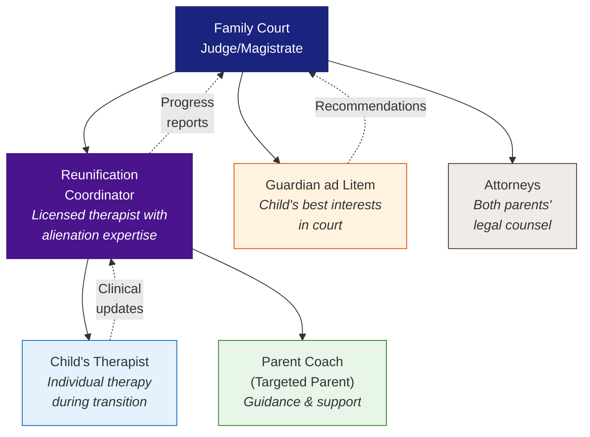

#### Reunification Professional Qualifications (Non-Negotiable)

The lead reunification therapist/coordinator MUST have:
- [ ] Licensed mental health professional (LCSW, LPC, PhD, PsyD)
- [ ] Specific training in parental alienation dynamics
- [ ] Experience conducting reunification (not just individual therapy)
- [ ] Understanding that the child's rejection is a symptom of alienation, not a boundary
- [ ] Willingness to work within a court-ordered framework
- [ ] Willingness to make recommendations the alienating parent may not like
- [ ] No prior therapeutic relationship with either parent or child (avoiding dual relationships)

#### Red Flags in Reunification Professionals
Disqualify any professional who:
- Believes the child should "choose" whether to have a relationship
- Treats the child's stated preference as decisive without assessing alienation
- Refuses to acknowledge parental alienation as a valid dynamic
- Allows the alienating parent to control the pace or terms
- Blames the targeted parent for the child's rejection
- Has no specific alienation training
- Requires the targeted parent to "earn" the child's trust (placing burden on the victim)

### 1.4 Court Orders

Effective reunification requires court orders that include:
- [ ] Specific reunification program and provider named
- [ ] Timeline and phase structure defined
- [ ] Consequences for non-compliance by either parent
- [ ] Alienating parent's obligations clearly stated
- [ ] Contact schedule for each phase
- [ ] Communication protocols between parents
- [ ] Information-sharing requirements (school, medical, therapeutic)
- [ ] Review hearing dates for progress assessment
- [ ] Authority granted to reunification coordinator to adjust pace
- [ ] Prohibition on alienating behaviors (specifically enumerated)

---

## Phase 2: Preparation

### 2.1 Preparing the Targeted Parent

**Emotional Preparation:**
- Expect initial resistance from the child — this is normal
- Do not take the child's rejection personally (it is a product of the alienation)
- Do not criticize the alienating parent to the child, ever
- Be patient, warm, and consistent
- Manage your own grief and anger with your own therapist — not with the child
- Prepare for setbacks — they are part of the process

**Practical Preparation:**
- [ ] Home is child-ready (bedroom, supplies, familiar items if possible)
- [ ] Age-appropriate activities planned (low-pressure, fun, no interrogation)
- [ ] Support person available (not present during contact, but available for parent)
- [ ] Communication method established with reunification coordinator
- [ ] Self-care plan in place for difficult days

**Communication Guidelines for Targeted Parents:**

| Do | Don't |
|----|-------|
| "I'm so glad to see you" | "I missed you so much" (can create guilt) |
| "What would you like to do?" | "Why didn't you call me back?" |
| "I love you no matter what" | "Your mom/dad is keeping you from me" |
| "It's okay to have big feelings" | "You don't really feel that way" |
| "I'm here whenever you're ready" | "You have to talk to me" |
| Share your own feelings calmly | Cry, rage, or emotionally overwhelm the child |

### 2.2 Preparing the Child

The reunification professional should:
- [ ] Meet with the child individually to build rapport
- [ ] Assess the child's understanding of the situation (often distorted)
- [ ] Provide age-appropriate psychoeducation about family relationships
- [ ] Normalize having a relationship with both parents
- [ ] Address fears and anxieties without reinforcing alienation narratives
- [ ] NOT allow the child to "opt out" of the process (this enables the alienation)
- [ ] Set clear expectations about what will happen and when

### 2.3 The Alienating Parent's Role

The alienating parent MUST:
- [ ] Comply with all court orders regarding reunification
- [ ] Actively support the child's relationship with the targeted parent (verbally and behaviorally)
- [ ] Cease all denigration, interference, and manipulative behaviors
- [ ] Facilitate transitions without conflict or distress
- [ ] Not interrogate the child after contact with the targeted parent
- [ ] Not use the child as a messenger or information source
- [ ] Attend their own therapy to address alienating behaviors
- [ ] Follow communication protocols established by the court/coordinator

**Consequences for Non-Compliance:**
Non-compliance by the alienating parent is the #1 reason reunifications fail. Court orders must include escalating consequences:

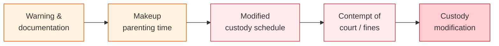

---

## Phase 3: Reintroduction

### 3.1 Graduated Contact Plan

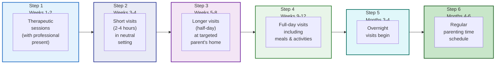

> **Note:** This timeline is approximate. The reunification coordinator adjusts pace based on progress. Faster is generally better — delays give the alienating dynamic time to reassert.

### 3.2 Session Structure

Each therapeutic bridge session should include:

1. **Check-in** (5 min) — How is the child feeling? Any concerns?
2. **Activity** (30-45 min) — Shared activity between parent and child (games, art, cooking, sports)
3. **Processing** (10-15 min) — Therapist helps parent and child reflect on the experience
4. **Planning** (5 min) — What will next time look like?

### 3.3 Managing Resistance

When the child resists contact:

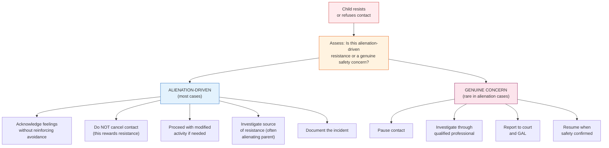

**Key Indicators of Alienation-Driven Resistance:**
- Resistance increases after time with the alienating parent
- Child uses adult language or legal terminology
- Child recites grievances they could not independently know
- Rejection is absolute with no ambivalence
- Resistance extends to targeted parent's entire family
- Child shows anxiety about "getting in trouble" with the alienating parent

---

## Phase 4: Stabilization

### 4.1 Expanding Contact

As the child demonstrates comfort, systematically increase:
- Visit duration (hours → half-day → full day → overnight)
- Visit frequency (weekly → per custody schedule)
- Activity types (structured → unstructured → daily routines)
- Settings (neutral → targeted parent's home → community activities)
- Supervision level (therapeutic → monitored → unsupervised)

### 4.2 Building Normalcy

The goal is a normal parent-child relationship. This includes:
- [ ] Regular mealtimes together
- [ ] Homework help and school involvement
- [ ] Bedtime routines (for overnights)
- [ ] Attending child's activities and events
- [ ] Meeting child's friends
- [ ] Shared family traditions and holidays
- [ ] Age-appropriate chores and responsibilities
- [ ] Natural parent-child conflict resolution (disagreements are normal)

### 4.3 Addressing Ongoing Alienation

Monitor for continued alienating behaviors:

| Warning Sign | Response |
|-------------|----------|
| Child returns from alienating parent with renewed resistance | Document, report to coordinator, maintain contact schedule |
| Alienating parent "forgets" exchanges | Document, enforce through court order |
| Child reports being questioned about visits | Document child's statements, report to coordinator |
| Alienating parent makes new allegations | Document, attorney response, do not cancel contact |
| Child has new therapist chosen by alienating parent | Notify court, object to dual therapeutic relationships |
| Alienating parent schedules conflicts during parenting time | Document, request makeup time, enforce order |

---

## Phase 5: Long-Term Integration

### 5.1 Normalized Parenting Schedule

The endpoint is a standard custody arrangement that may include:
- Regular weekly parenting time
- Alternating weekends
- Holiday rotation
- Vacation time
- Unrestricted phone/video contact
- Full parental access to school, medical, and activity information

### 5.2 Ongoing Monitoring

For 12-24 months after stabilization:
- [ ] Quarterly check-ins with reunification coordinator
- [ ] Monitoring for relapse in alienating behaviors
- [ ] Child's therapist reports on adjustment
- [ ] Court review hearings as scheduled
- [ ] Documentation of any new incidents

### 5.3 Relapse Prevention

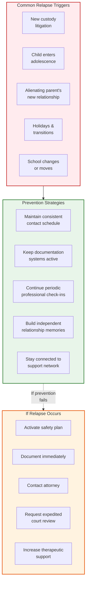

---

## Progress Tracking

### Reunification Milestone Checklist

| Phase | Milestone | Target Date | Achieved | Notes |
|-------|-----------|-------------|----------|-------|
| 1 | Assessment complete | | [ ] | |
| 1 | Reunification team selected | | [ ] | |
| 1 | Court orders in place | | [ ] | |
| 2 | Targeted parent preparation complete | | [ ] | |
| 2 | Child preparation sessions complete | | [ ] | |
| 2 | Alienating parent obligations communicated | | [ ] | |
| 3 | First therapeutic session held | | [ ] | |
| 3 | First unsupervised short visit | | [ ] | |
| 3 | First half-day visit at parent's home | | [ ] | |
| 3 | First full-day visit | | [ ] | |
| 4 | First overnight visit | | [ ] | |
| 4 | Regular parenting schedule begins | | [ ] | |
| 4 | Child attending activities with targeted parent | | [ ] | |
| 4 | Supervision fully removed | | [ ] | |
| 5 | Standard custody schedule in place | | [ ] | |
| 5 | 6-month stability check | | [ ] | |
| 5 | 12-month stability check | | [ ] | |
| 5 | Reunification coordinator discharge | | [ ] | |

### Session Progress Journal

| Session # | Date | Duration | Activities | Child's Mood (Start) | Child's Mood (End) | Highlights | Concerns | Next Steps |
|-----------|------|----------|-----------|---------------------|-------------------|------------|----------|------------|
| 1 | | | | | | | | |
| 2 | | | | | | | | |
| 3 | | | | | | | | |

---

## Ethical Standards for Reunification

### What Ethical Reunification IS:
- Court-ordered, professionally guided, and evidence-based
- Prioritizes the child's right to a relationship with both safe parents
- Recognizes the child's resistance as a symptom of alienation
- Includes accountability for the alienating parent
- Uses graduated contact with therapeutic support
- Monitored by qualified professionals with alienation expertise
- Time-limited with clear milestones and goals
- Grounded in research on child development and attachment

### What Ethical Reunification IS NOT:
- Forcing a child into an unsafe situation
- Ignoring genuine abuse or safety concerns
- Punishing the child
- Operating without professional oversight
- Allowing the alienating parent to control the process
- A single session or event (it is a sustained process)
- Dependent solely on the child's stated wishes
- Therapy that asks the targeted parent to "earn" the child's love

---

## When Reunification Is Not Progressing

If reunification stalls or regresses, evaluate:

1. **Is the alienating parent complying?** (Most common cause of failure)
2. **Is the professional qualified?** (Second most common cause)
3. **Is the court enforcing orders?** (Third most common cause)
4. **Does the contact schedule need adjustment?**
5. **Are there new alienating behaviors to document?**
6. **Does the child need additional therapeutic support?**
7. **Is a custody modification needed?**

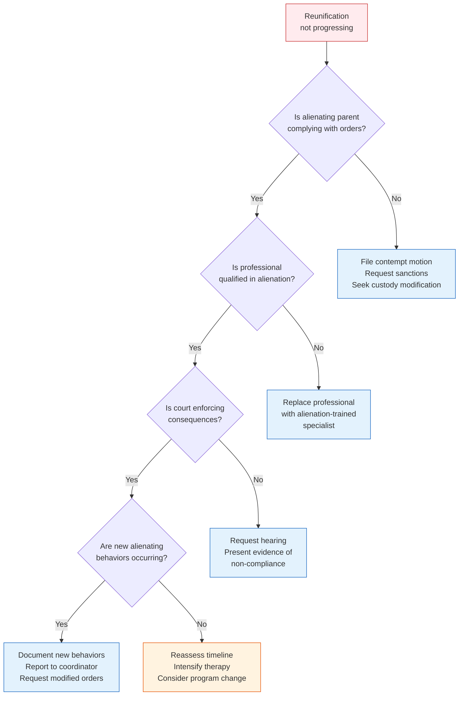

---

## Criminal Custodial Interference

When alienation crosses the line into criminal conduct, parents need to understand the legal framework.

### What Is Criminal Custodial Interference?

Custodial interference (also called custodial kidnapping, interference with custody, or violation of custody order) is a criminal offense in most states. It occurs when a person takes, detains, conceals, or entices a child in violation of a custody order or the other parent's custodial rights.

### Common Criminal Scenarios in Alienation Cases

| Scenario | Potential Criminal Charge | Severity |
|----------|--------------------------|----------|
| Refusing to return child after scheduled parenting time | Custodial interference / contempt | Misdemeanor to felony |
| Fleeing the jurisdiction with the child | Custodial kidnapping / parental kidnapping | Felony |
| Concealing the child's location | Concealment of a child | Felony |
| Enrolling child in school in a different state without consent/order | Custodial interference | Varies by state |
| Obtaining passport and leaving the country | International parental kidnapping (federal crime) | Felony |
| Deliberately alienating to sever contact entirely | Varies — some states criminalizing "custody deprivation" | Varies |
| Filing false abuse reports to gain custody advantage | Filing false reports / perjury | Misdemeanor to felony |

### When to Pursue Criminal Remedies

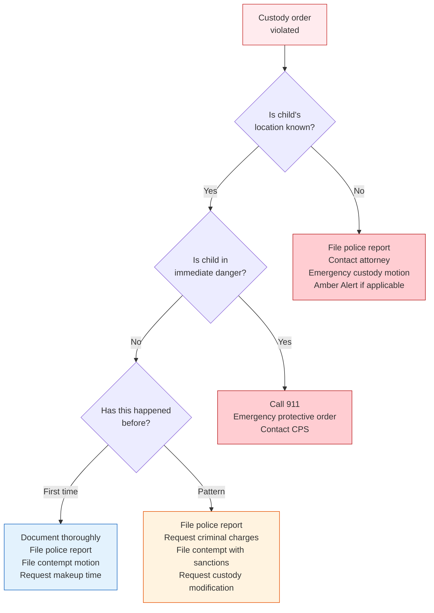

### State Considerations
- Laws vary significantly by state — always consult an attorney in your jurisdiction
- Some states treat first offenses as misdemeanors, with felony escalation for repeat offenses
- Federal law (International Parental Kidnapping Crime Act, 18 U.S.C. § 1204) applies to international cases
- The Uniform Child Custody Jurisdiction and Enforcement Act (UCCJEA) governs interstate disputes
- Some states have "affirmative defense" provisions that complicate prosecution
- Document everything — criminal cases require evidence beyond a reasonable doubt

### Documentation for Criminal Cases

In addition to standard incident documentation, criminal cases require:
- [ ] Certified copy of custody order being violated
- [ ] Evidence of notice (did the other parent know about the order?)
- [ ] Timeline of violation (when was the child supposed to be returned? when was access denied?)
- [ ] Communication attempts (texts, calls, emails showing your attempts to exercise custody)
- [ ] Police report number and responding officer information
- [ ] Witness statements (who observed the violation?)
- [ ] Prior violations (pattern evidence)
- [ ] Child's statements (if age-appropriate, documented without coaching)

---

## Diagnosis & Assessment

### Clinical Assessment of Parental Alienation

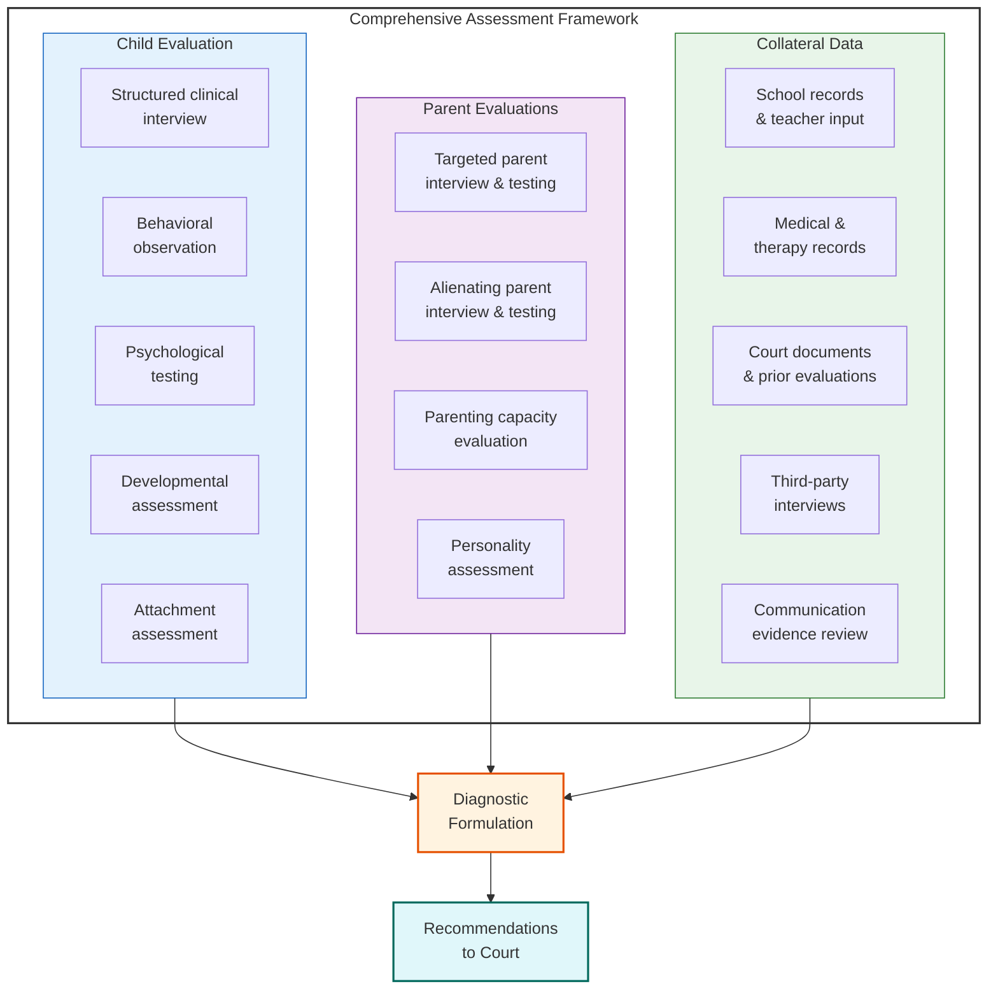

### Diagnostic Frameworks

Parental alienation is recognized in multiple diagnostic and clinical systems:

**DSM-5 / DSM-5-TR:**
- **V61.29 (Z62.898)** — Child Affected by Parental Relationship Distress
- **V61.20 (Z62.820)** — Parent-Child Relational Problem
- **V995.51 (T74.32)** — Child Psychological Abuse, Confirmed
- **309.4 (F43.25)** — Adjustment Disorder with Mixed Disturbance of Emotions and Conduct

**ICD-11:**
- **QE52.0** — Caregiver-child relationship problem
- **QE70** — Problem associated with interpersonal interactions in childhood

**Clinical Literature:**
- Gardner's original 8 criteria (1985, refined through 2002)
- Five-Factor Model for Identifying Alienation (Warshak)
- Bernet's diagnostic criteria for Parental Alienation Disorder
- Kelly & Johnston's continuum model of parent-child contact problems
- Childress's attachment-based model (AB-PA)

### The Five-Factor Assessment Model

A child is experiencing alienation when ALL five factors are present:

| Factor | Description | Assessment Method |
|--------|-------------|-------------------|
| **1. Contact refusal/resistance** | Child resists or refuses contact with a previously loved parent | Behavioral observation, parent reports, school/therapy records |
| **2. Prior positive relationship** | Child had a positive relationship with the now-rejected parent before the alienation | Historical records, photos, school reports, witness statements |
| **3. Absence of abuse/neglect** | No substantiated evidence that the rejected parent is abusive or neglectful | CPS records, police reports, professional evaluations |
| **4. Alienating behaviors by favored parent** | The favored parent engages in behaviors that undermine the child's relationship with the other parent | Communication records, behavioral observations, collateral reports |
| **5. Alienation symptoms in the child** | The child displays characteristic symptoms (see below) | Clinical interview, behavioral observation, psychological testing |

### Eight Behavioral Indicators in the Child

| Indicator | Description | Example |
|-----------|-------------|---------|
| **1. Campaign of denigration** | Child actively participates in criticizing the targeted parent | "I hate Dad. He's a terrible person." |
| **2. Weak, frivolous rationalizations** | Reasons for rejection are absurd or trivial | "He once made me eat broccoli" |
| **3. Lack of ambivalence** | Targeted parent is all bad, alienating parent is all good | No positive memories or mixed feelings |
| **4. Independent thinker phenomenon** | Child insists the rejection is entirely their own idea | "Nobody told me to feel this way" |
| **5. Reflexive support** | Child automatically sides with the alienating parent in all disputes | Takes sides without knowing facts |
| **6. Absence of guilt** | No remorse about cruelty toward the targeted parent | Indifferent to parent's pain |
| **7. Borrowed scenarios** | Child recounts events using adult language or describes events they couldn't know about | Uses legal terms, financial details |
| **8. Rejection of extended family** | Hatred extends to the targeted parent's entire family | Refuses grandparents, cousins, etc. |

### Severity Assessment

```mermaid
flowchart LR
    subgraph mild["MILD"]
        M1["Some resistance<br/>but visits occur"]
        M2["Ambivalence<br/>still present"]
        M3["Relationship<br/>partially intact"]
    end
    
    subgraph moderate["MODERATE"]
        MD1["Significant<br/>resistance"]
        MD2["Visits strained<br/>or intermittent"]
        MD3["Child parrots<br/>alienating parent"]
    end
    
    subgraph severe["SEVERE"]
        S1["Complete<br/>refusal of contact"]
        S2["No ambivalence<br/>whatsoever"]
        S3["Extended family<br/>also rejected"]
        S4["Child may be<br/>aggressive or<br/>threatening"]
    end

    mild -->|"Without intervention<br/>escalates to"| moderate -->|"Without intervention<br/>escalates to"| severe

    style mild fill:#fff3e0,stroke:#e65100,stroke-width:2px
    style moderate fill:#ffebee,stroke:#c62828,stroke-width:2px
    style severe fill:#ffcdd2,stroke:#b71c1c,stroke-width:2px
```

### Differential Diagnosis

It is critical to distinguish alienation from other causes of contact resistance:

| Alienation | Estrangement | Realistic Safety Concern | Developmental/Other |
|------------|-------------|--------------------------|---------------------|
| Child's rejection is disproportionate to experience | Child's rejection is proportionate to harmful parenting | Child has experienced substantiated abuse/neglect | Separation anxiety, loyalty conflicts, adjustment issues |
| No substantiated abuse by rejected parent | Documented history of harsh, neglectful, or abusive parenting | Evidence of harm independent of other parent's claims | Normal developmental phases (adolescent individuation) |
| Alienating behaviors documented | No campaign by favored parent | Child shows trauma symptoms consistent with reported experience | Recent life changes (new school, move, divorce adjustment) |
| Child has borrowed scenarios, adult language | Child has age-appropriate descriptions of own experiences | Professional assessment confirms safety concerns | Child may warm up with time and support |
| All 8 behavioral indicators present | Some indicators present with legitimate basis | Fear response is proportionate and context-specific | Transient, resolves with stability |

---

## Treatment & Therapeutic Interventions

### Intervention Continuum

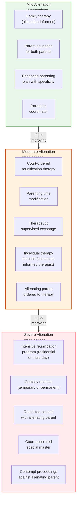

### Evidence-Based Treatment Approaches

| Approach | Description | Best For | Key Features |
|----------|-------------|----------|-------------|
| **Family Bridges** (Warshak) | Workshop-based psychoeducational program | Moderate to severe | 4-day intensive, research-backed, includes follow-up |
| **Overcoming Barriers** (Sullivan) | Family-centered treatment with clear structure | Mild to moderate | Focuses on both parents' contributions to conflict |
| **Turning Points for Families** | Multi-session therapeutic program | Moderate to severe | Court-integrated, includes accountability |
| **Attachment-Based Intervention** (Childress) | Addresses underlying attachment pathology | All severities | Focuses on attachment system deactivation |
| **Multi-Modal Reunification** | Combined individual, dyadic, and family therapy | All severities | Tailored to family's specific dynamics |

### Treatment Red Flags

Approaches that are **harmful or ineffective** for alienation:

| Harmful Approach | Why It Fails |
|-----------------|-------------|
| "Let the child decide" | Rewards the alienation, empowers the alienating parent's campaign |
| Individual therapy for the child only (without addressing the family system) | Therapist often aligns with the child's distorted narrative |
| Requiring the targeted parent to "earn" the child's trust | Places the burden on the victim, reinforces the alienation narrative |
| Extended "therapeutic separation" from targeted parent | Cements the alienation, gives more time for the dynamic to entrench |
| Couples therapy for the parents | Alienation is abuse, not a mutual conflict to mediate |
| Mediation without addressing the power imbalance | Alienating parent uses mediation to further delay and control |

### Treatment Planning Template

| Component | Details |
|-----------|---------|
| **Primary diagnosis** | Parent-Child Relational Problem (V61.20 / Z62.820) with features of child psychological abuse |
| **Severity level** | Mild / Moderate / Severe |
| **Treatment modality** | [Specific program or approach] |
| **Treatment goals** | 1. Restore safe parent-child contact 2. Reduce alienating behaviors 3. Address child's distorted beliefs 4. Build sustainable co-parenting structure |
| **Participants** | Child, targeted parent, alienating parent (separate and joint as indicated) |
| **Frequency** | [Weekly / intensive / per program structure] |
| **Duration** | [Estimated timeline with milestones] |
| **Court coordination** | [Reporting schedule, review hearings] |
| **Success metrics** | [Specific, measurable outcomes] |
| **Contingency plan** | [If progress stalls, next escalation step] |

---

## Evaluator & Professional Standards

### What a Competent Custody Evaluation Should Include

When alienation is alleged, a thorough custody evaluation must assess:

- [ ] Both parents individually (equal time and depth)
- [ ] The child individually (multiple sessions)
- [ ] Parent-child observations (with EACH parent)
- [ ] Collateral contacts (teachers, coaches, therapists, family members)
- [ ] Document review (court records, communications, school/medical records)
- [ ] Psychological testing of both parents
- [ ] Assessment of alienating behaviors using validated frameworks
- [ ] Assessment of the child's symptoms against alienation criteria
- [ ] Differential diagnosis (alienation vs. estrangement vs. other causes)
- [ ] Clear recommendations with rationale

### Evaluator Competency Checklist

| Qualification | Required |
|--------------|----------|
| Licensed mental health professional | Yes |
| Forensic evaluation training | Yes |
| Specific alienation training (workshops, certification, supervised cases) | Yes |
| Familiarity with current alienation research | Yes |
| Understanding of coercive control dynamics | Yes |
| Experience testifying in family court | Preferred |
| No dual relationships with either party | Yes |
| Willingness to make difficult recommendations | Yes |

---

## Adult Children of Parental Alienation

### Understanding the Long-Term Impact

Parental alienation does not end when the child turns 18. Adult children of alienation often experience:

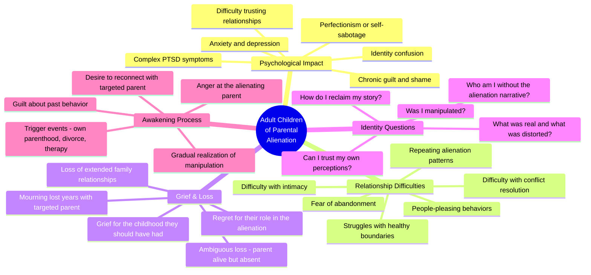

### The Awakening Process

Many adult children eventually realize they were alienated. This often occurs through:

1. **Life milestones** — becoming a parent themselves, going through their own divorce
2. **Distance from the alienating parent** — geographic or emotional distance allows independent thinking
3. **Therapy** — a skilled therapist helps the adult child examine their childhood narratives
4. **Contradictory evidence** — discovering that the targeted parent's "story" doesn't match what they were told
5. **The alienating parent's behavior toward others** — seeing the same patterns directed at new targets
6. **Relationships** — partners or friends question the alienation narrative

### Stages of Awakening

| Stage | Experience | What They Need |
|-------|-----------|----------------|
| **1. Doubt** | "Something doesn't add up about what I was told" | Safe space to question without judgment |
| **2. Investigation** | Seeking information, reaching out cautiously | Access to facts, patience from targeted parent |
| **3. Anger** | Rage at the alienating parent for the manipulation | Validation, therapy, support groups |
| **4. Grief** | Mourning lost years, lost relationship, lost childhood | Grief counseling, connection with others who understand |
| **5. Guilt** | "I said terrible things. I caused so much pain." | Reassurance that they were a child, not responsible |
| **6. Reconnection** | Reaching out to the targeted parent | Patient, non-pressuring response from targeted parent |
| **7. Integration** | Building a new narrative that includes the truth | Long-term therapy, family therapy, time |

### For Targeted Parents of Adult Children

**When your adult child reaches out:**
- Respond with warmth, not anger or guilt-tripping
- Do not overwhelm them with your pain (save that for your own therapist)
- Let them lead the pace of reconnection
- Answer their questions honestly but without burdening them
- Do not badmouth the alienating parent (even now)
- Acknowledge their experience without minimizing it
- Be patient — trust takes time to rebuild
- Consider family therapy with an alienation-informed therapist

**When your adult child has not yet awakened:**
- Keep the door open (cards, brief messages, life updates)
- Do not send guilt-inducing messages
- Maintain your own life, health, and relationships
- Stay connected to support networks
- Document your continued outreach (in case they later question whether you tried)
- Do not give up — many adult children reconnect in their 20s, 30s, or even later

### For Adult Children Seeking Reconnection

**Steps toward healing:**
1. Find a therapist who understands alienation dynamics (not all do)
2. Allow yourself to grieve without rushing to "fix" everything
3. Reach out to the targeted parent when YOU are ready (not when pressured)
4. Expect the reconnection to be imperfect — and that's okay
5. Set boundaries with the alienating parent if needed (you may need space to heal)
6. Connect with other adult children of alienation (support groups, online communities)
7. Be patient with yourself — you were a child; you did the best you could

### Resources for Adult Children
- **Support Groups:** Online communities for adults who were alienated as children
- **Recommended Reading:** (consult PACCS research library for current list)
- **Therapeutic Approaches:** Individual therapy, family therapy with targeted parent, group therapy with other adult survivors

---

## Disclaimer

This protocol is for **educational and informational purposes only**. It does not constitute legal, medical, or mental health advice. Every family's situation is unique. Reunification should always be conducted under the guidance of qualified professionals and pursuant to court orders.

If you or your child is in immediate danger, call **911**.

For support:
- Childhelp National Child Abuse Hotline: **1-800-422-4453**
- National Domestic Violence Hotline: **1-800-799-7233**
- National Suicide Prevention Lifeline: **988**

---

*PACCS — Professional Alliance for Child Centered Safety*
*Reunification Protocol v1.0 — Because every child has the right to love both parents.*
