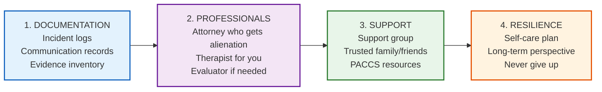
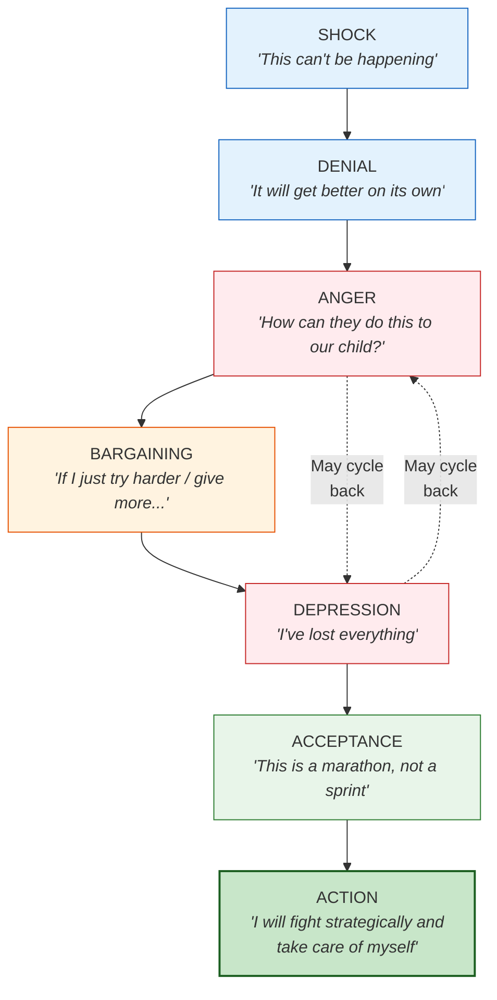

# PACCS Guide for Parents Experiencing Parental Alienation

If you are a parent being alienated from your child, this guide is for you. You are not alone. What is happening to you and your child is real, it is documented, and there is a path forward.

---

## First: You Are Not Crazy

If you are experiencing any of the following, you may be dealing with parental alienation:

- Your child suddenly refuses to see you or speak to you
- Your child recites reasons for rejecting you that sound rehearsed or use adult language
- Your co-parent consistently blocks, delays, or "forgets" your parenting time
- Your child says things about you that are untrue or wildly exaggerated
- Your child's rejection extends to your parents, siblings, and extended family
- Your co-parent has filed false allegations of abuse against you
- Professionals (therapists, teachers, doctors) seem to have a one-sided view of the situation
- Your child shows no ambivalence — you are all bad, the other parent is all good

**This is parental alienation, and it is a form of child abuse.**

---

## What to Do RIGHT NOW

### If Contact Has Just Been Denied

1. **Document** — write down the date, time, and exactly what happened
2. **Attempt contact** — send a calm, brief text or email ("I'm here for our scheduled time. Please let me know when [child] will be ready.")
3. **Screenshot everything** — save all communications
4. **Call your attorney** — if you have one
5. **File a police report** — if a court order is being violated
6. **Do NOT** — force a confrontation, make threats, show up unannounced, or vent on social media

### If False Allegations Have Been Made

1. **Do NOT** speak to investigators without an attorney
2. **Do NOT** contact the accusing parent
3. **Write down** your account of events immediately (date, time, location, witnesses, what really happened)
4. **Preserve ALL evidence** — do not delete anything
5. **Contact an attorney** — this is urgent; if you can't afford one, contact legal aid
6. **Continue following all court orders** — do not give anyone a reason to question you

### If Your Child Is Refusing Contact

1. **Do NOT blame or pressure the child** — they are a victim too
2. **Write down the child's exact words** (verbatim quotes)
3. **Note the context** — who dropped them off, what was said, their demeanor
4. **Keep showing up** — for every scheduled contact, even if the child refuses
5. **Send love** — brief, non-pressuring messages: "I love you. I'm always here."
6. **Contact your attorney** — document the pattern

---

## Building Your Case

### The 4 Things You Need

### Documentation Basics

**Every single day that something happens, write it down.**

Use this format:
- **Date & Time:** When did it happen?
- **What happened:** Facts only — what you saw, heard, or received
- **Exact words:** Put direct quotes in quotation marks
- **Evidence:** Screenshot, email, text, witness — note where it's saved
- **Action taken:** What did you do?

**Golden Rule:** If it's not documented, it didn't happen (in the eyes of the court).

See the [Documentation Skill](../paccs-tech-documentation/SKILL.md) for full templates.

---

## Finding the Right Help

### Your Attorney

Your attorney is the most important person on your team. They MUST understand parental alienation.

**Ask these questions before hiring:**
1. "What is your understanding of parental alienation?"
2. "How many alienation cases have you handled?"
3. "When a child refuses contact, what do you believe the court should do?"
4. "Are you willing to pursue contempt and custody modification?"

**Walk away if they say:**
- "Maybe you should just give the child space"
- "The child is old enough to decide"
- "Parental alienation isn't a real thing"
- "Let's wait and see if things improve"

### Your Therapist

You need a therapist for YOU. This process is traumatic.

**Look for:**
- Experience with grief, loss, and trauma
- Understanding of alienation dynamics
- Supportive of you continuing to fight for your child
- Will NOT tell you to "let go" or "accept" the situation

### The Evaluator / GAL

If a custody evaluation is ordered, the evaluator's competence is critical.

**Demand an evaluator who:**
- Has specific alienation training
- Will interview BOTH parents equally
- Will talk to teachers, coaches, neighbors — not just therapists chosen by the alienating parent
- Will look at documented evidence, not just interviews
- Will assess for alienating behaviors, not just "parenting capacity"

---

## What to Expect in Court

### Reality Check

Family court in alienation cases is often:
- **Slow** — cases drag on for months or years
- **Expensive** — legal fees accumulate quickly
- **Frustrating** — judges may not understand alienation
- **Adversarial** — the alienating parent will frame you as the problem
- **Emotional** — hearing lies about yourself is painful

### How to Present Yourself

| DO | DON'T |
|----|-------|
| Dress professionally | Dress casually or provocatively |
| Speak calmly and factually | Get emotional or raise your voice |
| Answer only what is asked | Volunteer extra information or vent |
| Refer to documentation | Rely on memory alone |
| Show you support the child's relationship with both parents | Badmouth the other parent |
| Be respectful to the judge, even when frustrated | Show contempt or roll your eyes |
| Bring organized binders of evidence | Bring loose papers or expect to "wing it" |

### What Judges Need to Hear

Judges are not experts in alienation. Help them understand by presenting:

1. **The pattern** — not one incident, but a documented series of behaviors over time
2. **The impact on the child** — observable behavioral changes, not your opinion
3. **The child's words** — verbatim quotes that show adult language, borrowed scenarios
4. **The evidence** — texts, emails, recordings (if legal), witness statements
5. **The research** — your attorney should cite alienation research and professional standards
6. **What you're asking for** — specific remedies, not vague requests

---

## Protecting Your Mental Health

### The Emotional Stages of Alienation

Most targeted parents go through these stages (not always in order):

### Daily Survival Strategies

1. **Document, then let go** — write it down, store it, then stop ruminating
2. **One thing at a time** — you can't fix everything today; focus on the next step
3. **Move your body** — exercise is the single most effective anti-depressant available to you right now
4. **Stay connected** — isolation is your enemy; reach out to support groups, friends, family
5. **Limit court/case talk** — designate specific times; don't let it consume every conversation
6. **Maintain your identity** — you are more than this case; nurture your other roles and interests
7. **Write letters to your child** — even if you can't send them; keep a journal of love for when they come back
8. **Remember:** Your child needs you to survive this. They need you healthy and present for when the alienation breaks.

### When It Feels Hopeless

**Read this:**

> Many children who were alienated eventually come back. It may take months, years, or decades — but the alienation often breaks. When it does, your child will need you. Stay alive. Stay healthy. Stay ready.
>
> You did not cause this. You cannot control the alienating parent. But you CAN control how you respond. Document everything. Build your team. Take care of yourself. And never, ever stop loving your child — even from a distance.
>
> **If you are having thoughts of suicide, call 988 now. Your child needs you alive.**

---

## Emergency Resources

| Resource | Contact |
|----------|---------|
| **Emergency** | **911** |
| Childhelp National Child Abuse Hotline | 1-800-422-4453 (24/7) |
| National Domestic Violence Hotline | 1-800-799-7233 (24/7) |
| National Suicide Prevention Lifeline | **988** (24/7) |
| Crisis Text Line | Text **HOME** to **741741** |
| National Center for Missing & Exploited Children | 1-800-843-5678 |
| Legal Aid | [lawhelp.org](https://lawhelp.org) |

---

## Your Next Step

Pick ONE thing from this list and do it today:

- [ ] Start an incident log (use the template in [paccs-tech-documentation](../paccs-tech-documentation/SKILL.md))
- [ ] Save all recent texts/emails from co-parent to a secure backup
- [ ] Call a family law attorney who understands alienation
- [ ] Find a therapist for yourself
- [ ] Join a parental alienation support group
- [ ] Tell one trusted person what you're going through
- [ ] Read the [Reunification Protocol](REUNIFICATION-PROTOCOL.md) so you know what recovery looks like

**You are not alone. Your child needs you. Keep going.**

---

## Disclaimer

This guide is for **educational and informational purposes only**. It does not constitute legal, medical, or mental health advice. Every situation is unique. Always work with qualified professionals.

---

*PACCS — Professional Alliance for Child Centered Safety*
*Because every child has the right to love both parents safely.*
